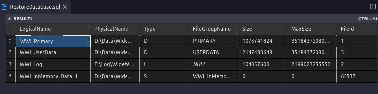
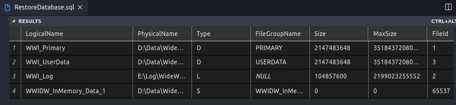

# Restore Database 
([Versão em Português](README.RestoreDB.pt.md) *Version in Portuguese in Development*)

Come back to [Docker SQL Server](README.md)

Using same SQL Server database samples from Microsoft for this restoring example on Docker

First to **avoid** permissions problems when you create the volume using ***docker-compose up*** create a new folder with the name restore or backup inside of your **folder data** previously created.

```
➜  DockerSqlserver git:(main) ✗ 
➜  DockerSqlserver git:(main) ✗ cd data
➜  data git:(main) ✗ mkdir restore
➜  data git:(main) ✗ cd restore
➜  restore git:(main) ✗ 
``` 

Databases to be Restored optionally **AdventureWorks2017**, **WideWorldImporters_Full** and **WideWorldImportersDW_Full**. If you have another database backup of your preference, feel free to use it ;)

## AdventureWorks2017.bak

https://github.com/Microsoft/sql-server-samples/releases/download/adventureworks/AdventureWorks2017.bak

```
➜  restore git:(main) ✗ curl -L -o AdventureWorks2017.bak 'https://github.com/Microsoft/sql-server-samples/releases/download/adventureworks/AdventureWorks2017.bak' 
``` 

## Restoring Database AdventureWorks2017

You can restore the database using the Vscode, Azure Data Studio or even the linux terminal. In this case we will use the Vscode.

On SQL Server button at the **Vscode side bar** click with the right mouse buuton on your respective Server name (for example **MY_DB**), Select **new query**.



Copy and paste the code below at the *.sql* created to restore the database. After this click on the button *Run Query* 

```
PRINT 'Restoring AdventureWorks2017....'
    RESTORE DATABASE AdventureWorks2017 
    FROM DISK='/var/opt/mssql/data/restore/AdventureWorks2017.bak' 
    WITH MOVE 'AdventureWorks2017' TO '/var/opt/mssql/data/AdventureWorks2017.MDF', 
    MOVE 'AdventureWorks2017_log' TO '/var/opt/mssql/data/AdventureWorks2017_log.ldf' 
    GO
```

WideWorldImports and WideWorldImportsDW. Those 2 are also database samples from microsoft made for you learn with **OLTP (OnLine Transaction Processing)**, **HTAP (hybrid transaction and analytical processing aka real-time operational analytics)** and **OLAP (OnLine Analytical Processing)**.

## WideWorldImporters_Full.bak 
(*full sample database for OLTP (OnLine Transaction Processing) and HTAP (hybrid transaction and analytical processing aka real-time operational analytics). For SQL Server 2016 SP1 (or higher), any edition.*)

## Download using curl (linux command) 

``` 
➜  restore git:(main) ✗ curl -L -o WideWorldImporters_Full.bak 'https://github.com/Microsoft/sql-server-samples/releases/download/wide-world-importers-v1.0/WideWorldImporters-Full.bak'
```

### For Windows you can use the **Invoke-RestMethod** command. See [Invoke-RestMethod](https://discoposse.com/2012/06/30/powershell-invoke-restmethod-putting-the-curl-in-your-shell/)

```
➜  Invoke-RestMethod -Uri www.discoposse.com/index.php/feed -Method Get
```

## Restoring database (Multiple logical files)

First check the logical file names of the database to avoid errors. 

```
   RESTORE FILELISTONLY FROM DISK = '/var/opt/mssql/data/restore/WideWorldImporters-Full.bak' WITH FILE = 1
```

Output


Restoring Database using the logical names from the list above.

```
PRINT 'Restoring WideWorldImporters-Full....'
   RESTORE DATABASE WideWorldImporters 
   FROM DISK = '/var/opt/mssql/data/restore/WideWorldImporters_Full.bak' 
   WITH MOVE 'WWI_Primary' TO '/var/opt/mssql/data/WideWorldImporters.mdf',
   MOVE 'WWI_UserData' TO '/var/opt/mssql/data/WideWorldImporters_userdata.ndf',
   MOVE 'WWI_Log' TO '/var/opt/mssql/data/WideWorldImporters.ldf',
   MOVE 'WWI_InMemory_Data_1' TO '/var/opt/mssql/data/WideWorldImporters_InMemory_Data_1'

   GO
```

## WideWorldImportersDW_Full.bak
*(full sample database for OLAP (OnLine Analytical Processing). For SQL Server 2016 SP1 (or higher), any edition)*.

## Download using curl (linux command)

```
➜  restore git:(main) ✗ curl -L -o WideWorldImportersDW_Full.bak  https://github.com/Microsoft/sql-server-samples/releases/download/wide-world-importers-v1.0/WideWorldImportersDW-Full.bak
```

First check the logical file names of the database to avoid errors. 

```
   RESTORE FILELISTONLY FROM DISK = '/var/opt/mssql/data/restore/WideWorldImportersDW-Full.bak' WITH FILE = 1
```

Output



Restoring Database using the logical names from the list above.

```
PRINT 'Restoring WideWorldImportersDW_Full....'
   RESTORE DATABASE WideWorldImportersDW 
   FROM DISK = '/var/opt/mssql/data/restore/WideWorldImportersDW-Full.bak' 
   WITH MOVE 'WWI_Primary' TO '/var/opt/mssql/data/WideWorldImportersDW.mdf',
   MOVE 'WWI_UserData' TO '/var/opt/mssql/data/WideWorldImportersDW_userdata.ndf',
   MOVE 'WWI_Log' TO '/var/opt/mssql/data/WideWorldImportersDW.ldf',
   MOVE 'WWIDW_InMemory_Data_1' TO '/var/opt/mssql/data/WideWorldImportersDW_InMemory_Data_1'
GO
```

Now your databases are restored and available on your SQL Server Docker Instance.


# REFERENCES

[Restoring a database on ms sql server for linux docker](https://docs.microsoft.com/en-us/sql/linux/tutorial-restore-backup-in-sql-server-container?view=sql-server-ver15)

[RESTORE Statements (Transact-SQL)](https://docs.microsoft.com/en-us/sql/t-sql/statements/restore-statements-transact-sql?view=sql-server-ver15)

---
Come back to [Docker SQL Server](README.md)
See [Versão em Português](README.RestoreDB.pt.md)
