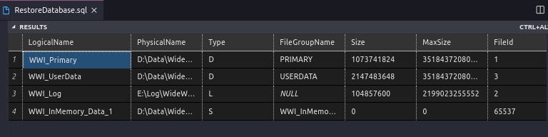
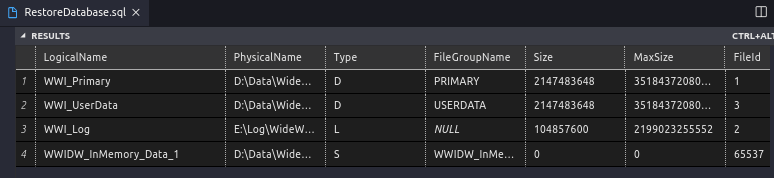
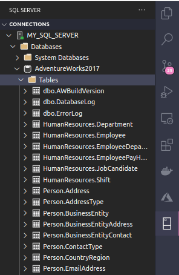

# Restore Database 
([Versão em Português](README.RestoreDB.pt.md) *Versão em Portugues em Desenvolvimento galera*)

Voltar para [Docker SQL Server](README.pt.md)

Usando as mesmas amostras de banco de dados SQL Server da Microsoft para este exemplo de restauração no Docker

Primeiro, para **evitar** problemas de permissão ao criar o volume usando ***docker-compose up***, crie uma nova pasta com o nome restore ou backup dentro da mesma **pasta data** criados anteriormente.

```
➜  DockerSqlserver git:(main) ✗ 
➜  DockerSqlserver git:(main) ✗ cd data
➜  data git:(main) ✗ mkdir restore
➜  data git:(main) ✗ cd restore
➜  restore git:(main) ✗ 
``` 

Banco de dados para serem alterados opcionalmente **AdventureWorks2017**, **WideWorldImporters_Full** and **WideWorldImportersDW_Full**. Se você tiver outro backup de banco de dados de sua preferência, fique à vontade para usá-lo;)

* AdventureWorks2017.bak

https://github.com/Microsoft/sql-server-samples/releases/download/adventureworks/AdventureWorks2017.bak

```
➜  restore git:(main) ✗ curl -L -o AdventureWorks2017.bak 'https://github.com/Microsoft/sql-server-samples/releases/download/adventureworks/AdventureWorks2017.bak' 
``` 

** Restoring Database AdventureWorks2017

Você pode restaurar o banco de dados usando o Vscode, Azure Data Studio ou até mesmo o terminal Linux. Neste caso, usaremos o Vscode.

No botão SQL Server na barra lateral ** Vscode ** clique com o botão direito do mouse no nome do seu respectivo servidor (por exemplo MY_DB), selecione a nova consulta.



Copie e cole o código abaixo no arquivo *.sql* criado para restaurar o banco de dados.  Depois, clique no botão *Run Query* 

```
PRINT 'Restoring AdventureWorks2017....'
    RESTORE DATABASE AdventureWorks2017 
    FROM DISK='/var/opt/mssql/data/restore/AdventureWorks2017.bak' 
    WITH MOVE 'AdventureWorks2017' TO '/var/opt/mssql/data/AdventureWorks2017.MDF', 
    MOVE 'AdventureWorks2017_log' TO '/var/opt/mssql/data/AdventureWorks2017_log.ldf' 
    GO
```

WideWorldImports e WideWorldImportsDW. Esses 2 também são amostras de banco de dados da Microsoft feitas para você aprender com **OLTP (OnLine Transaction Processing)**, **HTAP (transação híbrida e processamento analítico, também conhecido como análise operacional em tempo real)** e **OLAP (OnLine Analytical Processing)**.

## WideWorldImporters_Full.bak
(*banco de dados de amostra completo para OLTP (OnLine Transaction Processing) e HTAP (transação híbrida e processamento analítico, também conhecido como analítica operacional em tempo real). Para SQL Server 2016 SP1 (ou superior), qualquer edição*).

## Download usndo curl (commando do linux)

``` 
➜  restore git:(main) ✗ curl -L -o WideWorldImporters_Full.bak 'https://github.com/Microsoft/sql-server-samples/releases/download/wide-world-importers-v1.0/WideWorldImporters-Full.bak'
```

### Para Windows você pode utilizar o commando **Invoke-RestMethod**. Veja [Invoke-RestMethod](https://discoposse.com/2012/06/30/powershell-invoke-restmethod-putting-the-curl-in-your-shell/)

```
➜  Invoke-RestMethod -Uri www.discoposse.com/index.php/feed -Method Get
```

## Restaurando Banco de Dados (Multiplos arquivos lógicos)

Primeiro verifique os nomes dos arquivos lógicos do banco de dados para evitar erros. 

```
   RESTORE FILELISTONLY FROM DISK = '/var/opt/mssql/data/restore/WideWorldImporters-Full.bak' WITH FILE = 1
```

Saída (Output)


Restaurando o banco de dados usando os nomes lógicos da lista acima.

```
PRINT 'Restoring WideWorldImporters-Full....'
   RESTORE DATABASE WideWorldImporters 
   FROM DISK = '/var/opt/mssql/data/restore/WideWorldImporters_Full.bak' 
   WITH MOVE 'WWI_Primary' TO '/var/opt/mssql/data/WideWorldImporters.mdf',
   MOVE 'WWI_UserData' TO '/var/opt/mssql/data/WideWorldImporters_userdata.ndf',
   MOVE 'WWI_Log' TO '/var/opt/mssql/data/WideWorldImporters.ldf',
   MOVE 'WWI_InMemory_Data_1' TO '/var/opt/mssql/data/WideWorldImporters_InMemory_Data_1'

    GO
```

## WideWorldImportersDW_Full.bak
*(banco de dados de amostra completo para OLAP (OnLine Analytical Processing). Para SQL Server 2016 SP1 (ou superior), qualquer edição)*.

** Download using curl

```
➜  restore git:(main) ✗ curl -L -o WideWorldImportersDW_Full.bak  https://github.com/Microsoft/sql-server-samples/releases/download/wide-world-importers-v1.0/WideWorldImportersDW-Full.bak
```

Primeiro verifique os nomes dos arquivos lógicos do banco de dados para evitar erros (Mesmos passos do arquivo anterior). 

```
   RESTORE FILELISTONLY FROM DISK = '/var/opt/mssql/data/restore/WideWorldImportersDW-Full.bak' WITH FILE = 1
```

Saída (Output)



Restaurando o banco de dados usando os nomes lógicos da lista acima.

```
PRINT 'Restoring WideWorldImportersDW_Full....'
   RESTORE DATABASE WideWorldImportersDW 
   FROM DISK = '/var/opt/mssql/data/restore/WideWorldImportersDW-Full.bak' 
   WITH MOVE 'WWI_Primary' TO '/var/opt/mssql/data/WideWorldImportersDW.mdf',
   MOVE 'WWI_UserData' TO '/var/opt/mssql/data/WideWorldImportersDW_userdata.ndf',
   MOVE 'WWI_Log' TO '/var/opt/mssql/data/WideWorldImportersDW.ldf',
   MOVE 'WWIDW_InMemory_Data_1' TO '/var/opt/mssql/data/WideWorldImportersDW_InMemory_Data_1'
GO
```

Agora seus bancos de dados foram restaurados e estão disponíveis em sua instância Docker do SQL Server.



# REFERÊNCIAS

[Restoring a database on ms sql server for linux docker](https://docs.microsoft.com/en-us/sql/linux/tutorial-restore-backup-in-sql-server-container?view=sql-server-ver15)

[RESTORE Statements (Transact-SQL)](https://docs.microsoft.com/en-us/sql/t-sql/statements/restore-statements-transact-sql?view=sql-server-ver15)

---
Voltar para [Docker SQL Server](README.pt.md)
See [English Version](README.RestoreDB.en.md)
