# Using Docker to work with a SQL Server Database without need to install on your computer.

### A little explanation about Docker 
Read this in other languages: [English](README.md), [Portuguese version Soon](README.pt.md) 

Imagine that you work or are just learning many different technologies, My case, Guilty!!! or the situation of many of us that use  `NodeJS`, `React`, `C#`, `Ruby`, `PHP` or even `Haskell` (I was using few days ago \o/ or for instance you just want to run some linux commands in your laptop or PC without need to install a  [Virutal Box](https://www.virtualbox.org/) ou [VMWare](https://www.vmware.com/)) Those languages and their IDEs (integrated development environment) consume resources like HD, Memory, Processor and mainly **time***

Therefore, we have Docker to have access to an infinite of images of different platforms, that can be instantiated when necessary and can be discarded when no longer needed. For this, the application is on your machine and is accessed through the instantiated container.

Now, hands on.

# 1 - Configure SQL Server Docker [Quick Start](https://docs.microsoft.com/en-us/sql/linux/quickstart-install-connect-docker?view=sql-server-2017&pivots=cs1-bash)

Microsoft SQL Server on [Docker Hub](https://hub.docker.com/_/microsoft-mssql-server)

## Pull SQL Server Image 

Pull SQL Server Image (obs: Microsoft Doesn't use DockerFile : ( ) [Comeback Sql Server Password](#sqlserverpassword) 

```
sudo docker run -e "ACCEPT_EULA=Y" -e "SA_PASSWORD=YOUR_PASSWORD" -p 1433:1433 --name sqlserver2017 -v $(pwd)/data:/var/opt/mssql -d mcr.microsoft.com/mssql/server:2017-latest
``` 

* sudo docker run 
  * Execute docker with root permissions
* -e "ACCEPT_EULA=Y"
  * Set the ACCEPT_EULA variable to any value to confirm your acceptance of the End-User Licensing Agreement. Required setting for the SQL Server image.
* -e "SA_PASSWORD=YOUR_PASSWORD" 
  * Specify your own strong password that is at least 8 characters and meets the SQL Server password requirements. Required setting for the SQL Server image.
* -p 1433:1433
  *  Map a TCP port on the host environment (first value) with a TCP port in the container (second value). In this example, SQL Server is listening on TCP 1433 in the container and this is exposed to the port, 1433, on the host.
* --name sqlserver2017_1
  *  Specify a custom name for the container rather than a randomly generated one. If you run more than one container, you cannot reuse this same name.
* -v $(pwd)/data:/var/opt/mssql
  *  -v = Volume, define where the database configuration will be save locally.
* -d mcr.microsoft.com/mssql/server:2017-latest
  * The SQL Server 2017 Linux container image.


# If is necessary change de password:

```
sudo docker exec -it sqlserver2017 /opt/mssql-tools/bin/sqlcmd -S localhost -U SA -P "YOUROLDPASSWORD" -Q 'ALTER LOGIN SA WITH PASSWORD="<YourNewStrong@Passw0rd>"'
```

# START|STOP SQL SERVER

Use docker start|stop to start or stop the SQL Server instances

```
docker start sqlserver2017
docker stop sqlserver2017
```

# Create Alias to start|stop the SQL Server  

Add the line alias name='command' to your ``.zshrc`` file or for your default termninal file ``.bashrc`` in your **home folder** or just run the command below, although when you restart your computer, you will **lose** the alias.

``` 
alias SqlServerON='docker start sqlserver2017'
alias SqlServerOFF='docker stop sqlserver2017'
``` 


# Connect to sql to run commands inside the docker using **terminal**
You need to start the container before access or run any command inside it, otherwise 

```
➜  DockerSqlserver git:(master) ✗ sudo docker exec -it sqlserver2017 "bash"
Error response from daemon: Container fe06c3f734a2b11ff56977cfcc2bb971aee547d51c1976c9cd2b327cfde54ec5 is not running
``` 

After start the container 

```
sudo docker exec -it sqlserver2017 "bash"
``` 

# Access SQL Server inside the docker

Once you have access to the docker sql server container, you can access the **SQLCMD** (SQL Server command line to execute many commands, like create databases, tables, queries and much more). 
```
oot@fe06c3f734a2:/# /opt/mssql-tools/bin/sqlcmd -S localhost -U SA -P "YOUR_PASSWORD"
```

# Your First Query inside the Dockers

Create the database **MY_DB** another one that you think  

``` 
oot@fe06c3f734a2:/# /opt/mssql-tools/bin/sqlcmd -S localhost -U SA -P "YOUR_PASSWORD"
1> USE master GO
2> GO
Msg 102, Level 15, State 1, Server fe06c3f734a2, Line 1
Incorrect syntax near 'GO'.
1> USE master
2> GO
Changed database context to 'master'.
1> SELECT Name from sys.Databases 
2> GO
Name                                                                                                                            
---------------------------------------------------------
master                                                            
(1 rows affected)
1> 
``` 

# CREATE YOUR FIRST DATABASE

```
root@fe06c3f734a2:/# /opt/mssql-tools/bin/sqlcmd -S localhost -U SA -P "YOUR_PASSWORD"
1> CREATE DATABASE MY_DB
2> GO
1> USE MY_DB
2> GO
Changed database context to 'MY_DB'.
1> 
```

# CONFIGURE USING DOCKER-COMPOSE

1. Create *docker-compose.yml"
```
version: "3.5"
services: 
  db:
    image: "mcr.microsoft.com/mssql/server:2017-latest"
    container_name: sqlserver201701    
    environment:
        SA_PASSWORD: "MyPassword001"
        ACCEPT_EULA: "Y"
    ports:
      - "1433:1433"
    volumes: 
      - ${PWD}/../data:/var/opt/mssql
```

2. Run [docker-compose up](https://docs.docker.com/compose/reference/up/) - Builds, (re)creates, starts, and attaches to containers for a service.

```
docker-compose up --build -d   
```

  * up - Starts the container  
  * --build - Build images before starting containers.
  * -d - Detached mode: Run containers in the background, print new container names.

3. Check if the container is active

```
docker container ls
```
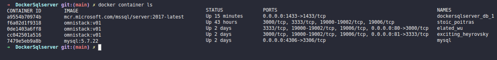

4. Attention for use the same container name with docker and docker-compose, you can get a error.

In this case change or add the same name into the **docker-compose.yml** for the parameter **container_name** [*container_name: sqlserver201701*], can result in a error once there is already a container name with the same name.

```
➜  DockerSqlserver git:(main) ✗ docker-compose up --build -d
Creating sqlserver2017 ... error

ERROR: for sqlserver2017  Cannot create container for service db: Conflict. The container name "/sqlserver2017" is already in use by container "fe06c3f734a2b11ff56977cfcc2bb971aee547d51c1976c9cd2b327cfde54ec5". You have to remove (or rename) that container to be able to reuse that name.

ERROR: for db  Cannot create container for service db: Conflict. The container name "/sqlserver2017" is already in use by container "fe06c3f734a2b11ff56977cfcc2bb971aee547d51c1976c9cd2b327cfde54ec5". You have to remove (or rename) that container to be able to reuse that name.
ERROR: Encountered errors while bringing up the project.
``` 
if you want to use the same name in your **docker-compose.yml**, to list all containers, you can use the commands (both return the same result):

```
sudo docker ps -a

or

docker container ls -a
```
`
 -a, --all             Show all containers (default shows just running)
`
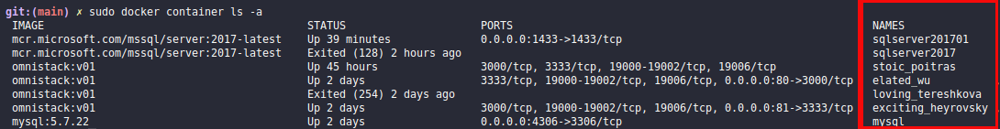
## Remove the containers 

To remove the existents containers and avoid conflicts between the containers created using docker run and docker-compose.yml, first stop the containers with the command:

```
sudo docker stop sqlserver2017
``` 
Now you can remove the container with the command.

```
sudo docker rm sqlserver2017
```

# CONFIGURE CONNECTION WITH VSCODE OR AZURE DATA STUDIO

## VSCODE

Use the shortcut <kbd>Ctrl</kbd> + <kbd>Shift</kbd> + <kbd>P</kbd> to access the Command Palette and Type: 

1. MSSQL -> Add Connection - click or press <kbd>Enter</kbd>
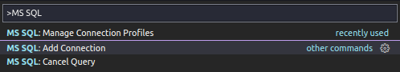

2. **Hostname\instance or <server>.database.windows.net or ADO.NET connection string** - The IP or Address of your server. In our case, as we are configuring a local instance of MSSQL, we are going to use *localhost* 
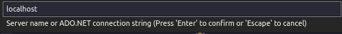

3. **Authentication Type [SQL Login|Integrated|Azure]** - Select SQL Login for we get to authenticate with the SQL Server password<br>
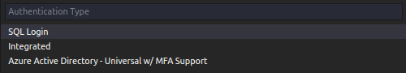

4. **Password** - Insert the password that you created when you pulled the docker Sql server instance <a id='sqlserverpassword' href="#pull-sql-server-image">Pull SQLServer image</a>. 
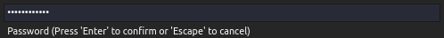

5. **Save your Password** - In case of you don't want to include the password everytime that you need to use the database
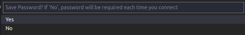

6. **Profile Name** - To easy access the connection next time
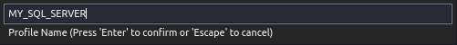

7. **Your Database on VSCode** - See your database clicking on SQL Server button or using the shortcut <kbd>Ctrl</kbd>+<kbd>Alt</kbd>+<kbd>D</kbd>. Create new queries, add new databases using VSCode.
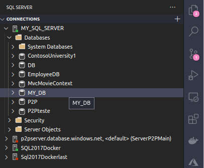

8. **Connection Error** - You can receive a connection error on VSCode in case of you don't [start](#startstop-sql-server) the SQL Server or if there is some information wrong about the connection. 
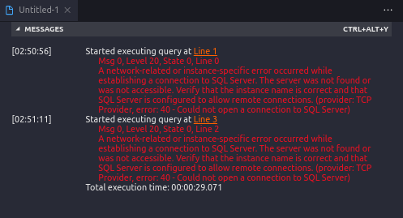

## AZURE DATA STUDIO

On Azure Data Studio is even easier to configure your connections with Microsoft SQL Server.

1. Open **Azure Data Studio**, if you don't have, <a href="https://docs.microsoft.com/en-us/sql/azure-data-studio/download-azure-data-studio?view=sql-server-ver15">Download here</a>  
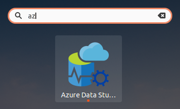

2. Click to create a new connection.
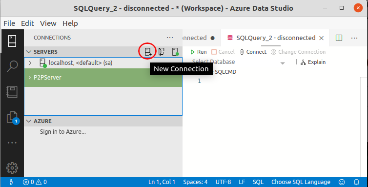

3. Fill the connection details with the same information that you have configured the VSCode connection. 
   You can also set a defaut database, in our case MY_DB and Save the connection the next time that you need.
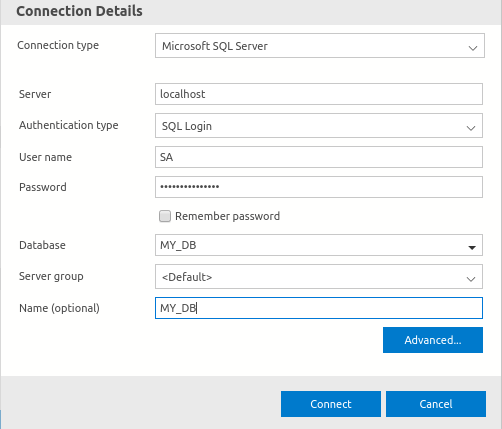

1. Create new queries, backups, restores and much more from the Database Dashboard.
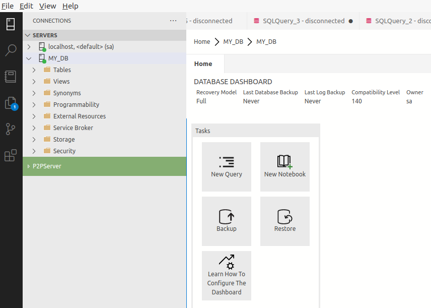

# NEXT

## USE SQL SERVER RETURN TABLES RENDERED AS HTML 

see: https://github.com/lexvieira/SQLtoHTMLTable (Under Construction)


