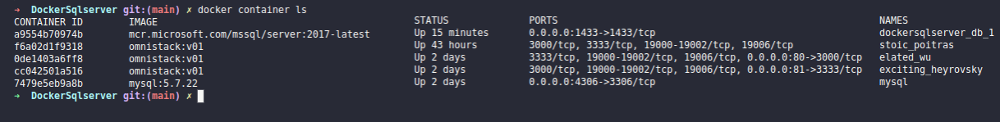
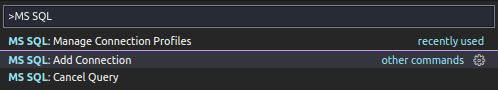
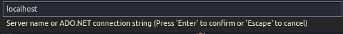
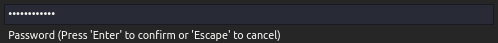
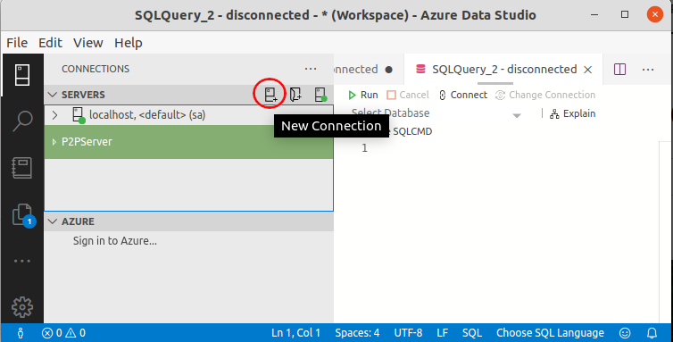

# Usando o Docker para trabalhar com um banco de dados SQL Server sem a necessidade de instalar em seu computador.
---

### Uma breve explicação sobre o que é um Docker. 
Leia em outros idiomas: [English](README.md), [Portuguese](README.pt.md).
Também
Restaurando uma base de dados dentro do docker container [Versão em Portuguese, Restaurando DB](README.RestoreDB.pt.md), [English Version, Restoring DB](README.RestoreDB.en.md)

Imagine que você trabalhe ou apenas esteja estudando varias technologias diferentes, Meu caso, culpado!!! :) ou o de varios de nós que utilizam `NodeJS`, `React`, `C#`, `Ruby`, `PHP` ou mesmo `Haskell` (Estava testando poucos dias atrás \o/) ou por examplo você só queira rodar alguns comandos em linux no seu Note ou PC sem ter que instalar um [Virutal Box](https://www.virtualbox.org/) ou [VMWare](https://www.vmware.com/).Essas linguagens e suas IDEs *(integrated development environment)*  consomem recursos como HD, Memória, Processador e principalmente **tempo**. *

Portanto, temos o Docker para ter acesso a uma infinidade de imagens de diferentes plataformas, que podem ser instanciadas quando necessário e podem ser descartadas quando não mais necessárias. Para isso, a aplicação fica na sua máquina e é acessada através do container instanciado. 

Agora, mãos na massa.

Primeiro, se você não tem o **docker** instalado, por favor instale seguindo as instruções em https://docs.docker.com/get-docker/

# Configurar o Docker SQL Server [Quick Start](https://docs.microsoft.com/en-us/sql/linux/quickstart-install-connect-docker?view=sql-server-2017&pivots=cs1-bash)

Microsoft SQL Server em [Docker Hub](https://hub.docker.com/_/microsoft-mssql-server)

## Pull SQL Server Image 

Faça um Pull (puxar) da imagem do SQL Server (obs: Microsoft Doesn't use DockerFile : ( ) [Comeback Sql Server Password](#sqlserverpassword) 

```
sudo docker run -e "ACCEPT_EULA=Y" -e "SA_PASSWORD=YOUR_PASSWORD" -p 1433:1433 --name sqlserver2017 -v $(pwd)/data:/var/opt/mssql -d mcr.microsoft.com/mssql/server:2017-latest
``` 

* sudo docker run 
  * Executa o comando docker com permissões de **root** (*administrador*)
* -e "ACCEPT_EULA=Y"
  * Defina a variável ACCEPT_EULA com qualquer valor para confirmar sua aceitação do Contrato de licença do usuário final. Configuração necessária para a imagem do SQL Server.
* -e "SA_PASSWORD=YOUR_PASSWORD" 
  * Especifique sua própria senha forte com pelo menos 8 caracteres e atenda aos requisitos de senha do SQL Server. Configuração necessária para a imagem do SQL Server.
* -p 1433:1433
  *  Mapeia uma porta TCP no ambiente do host (primeiro valor) com uma porta TCP no contêiner (segundo valor). Neste exemplo, o SQL Server está escutando TCP 1433 no contêiner e isso é exposto à porta, 1433, no host.
* --name sqlserver2017_1
  *  Especifique um nome personalizado para o contêiner em vez de um gerado aleatoriamente. Se você executar mais de um contêiner, não poderá reutilizar este mesmo nome.
* -v $(pwd)/data:/var/opt/mssql
  *  -v = Volume, defina onde a configuração do banco de dados será salva localmente.
* -d mcr.microsoft.com/mssql/server:2017-latest
  * A imagem do contêiner do Linux do SQL Server 2017.


## Caso seja necessário alterar a senha:

```
sudo docker exec -it sqlserver2017 /opt/mssql-tools/bin/sqlcmd -S localhost -U SA -P "YOUROLDPASSWORD" -Q 'ALTER LOGIN SA WITH PASSWORD="<YourNewStrong@Passw0rd>"'
```

## START|STOP SQL SERVER

Use o commando *docker start|stop* para iniciar ou parar a(s) instância(s) do SQL Server

```
docker start sqlserver2017
docker stop sqlserver2017
```

## Criar um  atalho (*Alias*) para iniciar ou parar o SQL Server

Adicione a linha *alias name='command'* no seu arquivo ``.zshrc`` or para o seu arquivo de terminal padrão ``.bashrc`` na sua **home folder** ou somente rode o comando abaixo, embora quando você reiniciar o computador, você irá **perder** a o alias (atalho).

``` 
alias SqlServerON='docker start sqlserver2017'
alias SqlServerOFF='docker stop sqlserver2017'
``` 

## Conecte ao SQL Server rodando os comandos dentro do docker usando o **terminal**
Você precisa iniciar o **container** antes de acessar ou executar qualquer comando dentro dele, caso contrário 

```
➜  DockerSqlserver git:(master) ✗ sudo docker exec -it sqlserver2017 "bash"
Error response from daemon: Container fe06c3f734a2b11ff56977cfcc2bb971aee547d51c1976c9cd2b327cfde54ec5 is not running
``` 

Depois de iniciar o container

```
sudo docker exec -it sqlserver2017 "bash"
``` 

## Accessando o SQL Server dentro do docker container

Assim que tiver acesso ao container do servidor docker sql, você poderá acessar o ** SQLCMD ** (linha de comando do SQL Server para executar muitos comandos, como criar bancos de dados, tabelas, consultas e muito mais). 

```
oot@fe06c3f734a2:/# /opt/mssql-tools/bin/sqlcmd -S localhost -U SA -P "YOUR_PASSWORD"
```

## Sua primeira query dentro de um **docker container**

``` 
oot@fe06c3f734a2:/# /opt/mssql-tools/bin/sqlcmd -S localhost -U SA -P "YOUR_PASSWORD"
1> USE master GO
2> GO
Msg 102, Level 15, State 1, Server fe06c3f734a2, Line 1
Incorrect syntax near 'GO'.
1> USE master
2> GO
Changed database context to 'master'.
1> SELECT Name from sys.Databases 
2> GO
Name                                                                                                                            
---------------------------------------------------------
master                                                            
(1 rows affected)
1> 
``` 

## CRIANDO O BANCO DE DADOS
Crie o banco de dados ** MY_DB ** outro que você achar melhor

```
root@fe06c3f734a2:/# /opt/mssql-tools/bin/sqlcmd -S localhost -U SA -P "YOUR_PASSWORD"
1> CREATE DATABASE MY_DB
2> GO
1> USE MY_DB
2> GO
Changed database context to 'MY_DB'.
1> 
```

# CONFIGURE USANDO DOCKER-COMPOSE

1. Criando o *docker-compose.yml"
```
version: "3.5"
services: 
  db:
    image: "mcr.microsoft.com/mssql/server:2017-latest"
    container_name: sqlserver201701    
    environment:
        SA_PASSWORD: "MyPassword001"
        ACCEPT_EULA: "Y"
    ports:
      - "1433:1433"
    volumes: 
      - ${PWD}/../data:/var/opt/mssql
```

2. Rode [docker-compose up](https://docs.docker.com/compose/reference/up/) - Compila(build), cria(recria), inicia e anexa a container para um serviço.

```
docker-compose up --build -d   
```

  * up - Starts the container  
  * --build - Build images before starting containers.
  * -d - Detached mode: Run containers in the background, print new container names.

3. Check if the container is active

```
docker container ls
```


4. Atenção ao usar o mesmo nome de container com docker e docker-compose, você pode obter um erro.

Nesse caso, alterar ou adicionar o mesmo nome em ** docker-compose.yml ** para o parâmetro ** container_name ** [* container_name: sqlserver201701 *], pode resultar em um erro, uma vez que já existe um nome de container com o mesmo nome.

```
➜  DockerSqlserver git:(main) ✗ docker-compose up --build -d
Creating sqlserver2017 ... error

ERROR: for sqlserver2017  Cannot create container for service db: Conflict. The container name "/sqlserver2017" is already in use by container "fe06c3f734a2b11ff56977cfcc2bb971aee547d51c1976c9cd2b327cfde54ec5". You have to remove (or rename) that container to be able to reuse that name.

ERROR: for db  Cannot create container for service db: Conflict. The container name "/sqlserver2017" is already in use by container "fe06c3f734a2b11ff56977cfcc2bb971aee547d51c1976c9cd2b327cfde54ec5". You have to remove (or rename) that container to be able to reuse that name.
ERROR: Encountered errors while bringing up the project.
``` 

Se quiser usar o mesmo nome em ** docker-compose.yml **, para listar todos os contêineres, você pode usar os comandos (ambos retornam o mesmo resultado):

```
sudo docker ps -a

or

docker container ls -a
```
`
 -a, --all             Mostra todos os contêineres (o padrão mostra apenas em execução
`


## Remover os containers 

Para remover os contêineres existentes e evitar conflitos entre os contêineres criados usando docker run e docker-compose.yml, primeiro interrompa os contêineres com o comando:

```
sudo docker stop sqlserver2017
``` 

Agora você pode remover o container com o comando.

```
sudo docker rm sqlserver2017
```

# CONFIGURAR CONEXÃO COM O VSCODE OU O AZURE DATA STUDIO

## VSCODE

use as teclas de atalho <kbd>Ctrl</kbd> + <kbd>Shift</kbd> + <kbd>P</kbd> para acessar a Paleta de comandos do **Vscode** e digite: 

1. MSSQL -> Add Connection - Clique ou pressione <kbd>Enter</kbd>


1. **Hostname\instance or <server>.database.windows.net or ADO.NET connection string** - O IP ou Endereço do seu servidor. No nosso caso, como estamos configurando uma instância local do SQL Server, vamos utilizar o *localhost* 


3. **Authentication Type [SQL Login|Integrated|Azure]** - Selecione SQL Login para que possamos autenticar com a senha do SQL Server<br>


4. **Password** - Insira a senha que você criou quando puxou a instância do servidor Sql do docker <a id='sqlserverpassword' href="#pull-sql-server-image">Pull SQLServer image</a>. 


5. **Save your Password** - Caso você não queira incluir a senha toda vez que precisar usar o banco de dados


6. **Profile Name** - Para facilitar o acesso à conexão na próxima vez


7. **Your Database on VSCode** - Veja seu banco de dados clicando no botão SQL Server ou usando o atalho <kbd> Ctrl </kbd> + <kbd> Alt </kbd> + <kbd> D </kbd>. Crie novas consultas, adicione novos bancos de dados usando VSCode.


8. **Connection Error** - Você pode receber um erro de conexão no VSCode caso não [inicie] (# startstop-sql-server) o SQL Server ou se houver alguma informação errada sobre a conexão. 


## AZURE DATA STUDIO

No Azure Data Studio é ainda mais fácil configurar suas conexões com o Microsoft SQL Server.

1. Abra o **Azure Data Studio**, se você não tem instalado, <a href="https://docs.microsoft.com/en-us/sql/azure-data-studio/download-azure-data-studio?view=sql-server-ver15">Faça o download aqui</a>  


2. Clique para criar uma nova conexão.


3. Preencha os detalhes da conexão com as mesmas informações que você configurou para a conexão VSCode.
   Você também pode definir um banco de dados padrão, em nosso caso MY_DB e Salvar a conexão na próxima vez que precisar.


1. Crie novas consultas, backups, restaurações e muito mais a partir do Database Dashboard.


# NEXT

## RESTAURAR BASE DE DADOS DENTRO DO CONTAINER
Restaurando base de dados usando docker container [Versão em Portuguese, Restaurando DB](README.RestoreDB.pt.md), [English Version, Restoring DB](README.RestoreDB.en.md)

## USE SQL SERVER RETURN TABLES RENDERED AS HTML 

see: https://github.com/lexvieira/SQLtoHTMLTable (Under Construction)


